# Frontend Architecture & Implementation Strategy

## Tech Stack (Modern Dashboard)

| Layer | Technology | Rationale |
| :--- | :--- | :--- |
| **Framework** | **Next.js 14 (App Router)** | Industry standard for strict routing, SEO, and performance. |
| **Styling** | **Tailwind CSS + `tailwindcss-animate`** | Utility-first for rapid implementation of custom premium designs. |
| **UI Library** | **Shadcn/UI** (Radix Primitives) | Accessible, copy-pasteable, highly customizable. |
| **Icons** | **Lucide React** | Clean, consistent SVG icons. |
| **State Management** | **TanStack Query v5** | Critical for "Real-time" feel (caching, optimistic updates). |
| **URL State** | **`nuqs`** | **Critical for Bookmarkability.** Syncs component state to URL search params. |
| **Theming** | **`next-themes`** | Seamless Light/Dark mode switching. |
| **Testing** | **Jest + RTL** | 80% coverage enforcement. |

## Thin Slicing Strategy

We are implementing the frontend in thin vertical slices:

### Slice 1: Foundation (Completed)
- Next.js 14 + TS + Tailwind initialization.
- Authentication (Clerk) integration.
- Testing infrastructure (Jest, Coverage).
- CI/CD checks (`npm run build`).

### Slice 2: The Shell & Navigation
- **Goal:** Create the persistent layout and navigation structure.
- **Tasks:**
  - Implement `AppSidebar` (Shadcn).
  - Implement `UserButton` & `ThemeToggle`.
  - Implement "Active Link" state logic.

### Slice 3: Dashboard Features
- **Goal:** Display read-only data from the backend.
- **Tasks:**
  - **Design Mockup (High Fidelity)** prior to code.
  - Implement "Garage" view (Cars list).
  - Connect to backend `GET /api/cars`.
  - Implement `nuqs` for persistent filtering.

### Slice 4: Data Entry
- **Goal:** Allow user interactions.
- **Tasks:**
  - Implement "Log Fillup" form.
  - Form validation with Zod + React Hook Form.
  - Mutation with TanStack Query.

  - Create `fly.frontend.staging.toml`.
  - Configure CI/CD pipeline.

## 🏛️ System Architecture (The Monolith)

This diagram illustrates how the Single-Container Monolith serves both the Frontend (UI) and Backend (API).

```mermaid
graph TD
    User((👤 User))
    CF[☁️ Cloudflare Proxy]
    Fly[fly.io Runtime]
    
    subgraph Container [Docker Container]
        SB[🍃 Spring Boot Server]
        
        subgraph Static [Static Resources]
            UI[⚛️ Next.js App]
            Assets[🎨 CSS/JS/Images]
        end
        
        subgraph Logic [Backend Logic]
            API[🔌 API Controllers]
            DB_Driver[PgJDBC]
        end
    end
    
    DB[(🐘 PostgreSQL)]

    User -->|Requests| CF
    CF --> Fly
    Fly -->|Port 8080| SB
    
    SB -->|Request / or /dashboard| UI
    SB -->|Request /assets/*| Assets
    SB -->|Request /api/*| API
    
    API --> DB
    
    style Container fill:#e6f7ff,stroke:#1890ff
    style UI fill:#ffffb8,stroke:#fadb14
    style SB fill:#d9f7be,stroke:#52c41a
```

## 🔄 Core User Flow

How a user interacts with the Auto-Ledger to log a fill-up.

```mermaid
sequenceDiagram
    actor User
    participant App as 📱 Frontend (Next.js)
    participant API as 🍃 Backend (Spring Boot)
    participant DB as 🐘 Database

    User->>App: Opens Dashboard
    App->>API: GET /api/cars
    API->>DB: Select Cars
    DB-->>API: List of Cars
    API-->>App: JSON Data
    App-->>User: Displays Garage

    User->>App: Clicks "Log Fill-up"
    App-->>User: Shows Form (Zod Validation)
    User->>App: Enters Odometer: 10500, Gallons: 10
    App->>App: Validates Input (Client-side)
    
    App->>API: POST /api/fillups
    API->>DB: Fetch Previous Fill-up
    DB-->>API: Last Odometer: 10100
    
    note right of API: Domain Logic:<br/>Calc MPG = (10500-10100)/10 = 40 MPG
    
    API->>DB: Insert Fill-up
    DB-->>API: Success
    API-->>App: 200 OK (New Fill-up)
    
    App->>App: Invalidate Query Cache
    App->>API: GET /api/cars (Refetch)
    App-->>User: Updates Dashboard with new MPG
```

